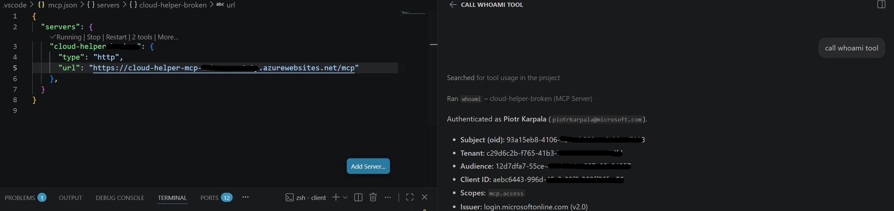
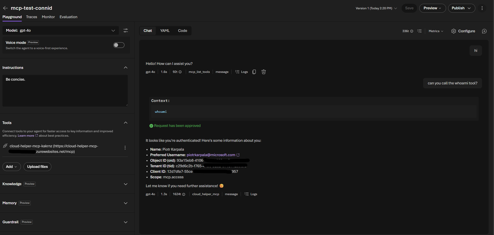
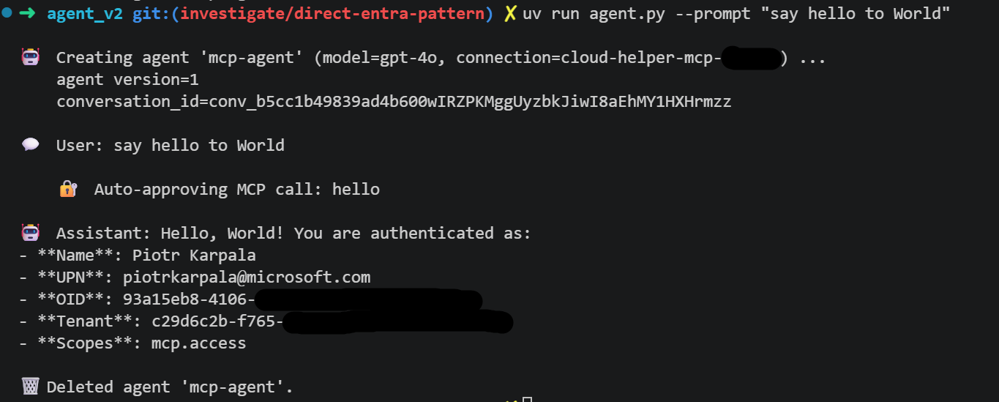
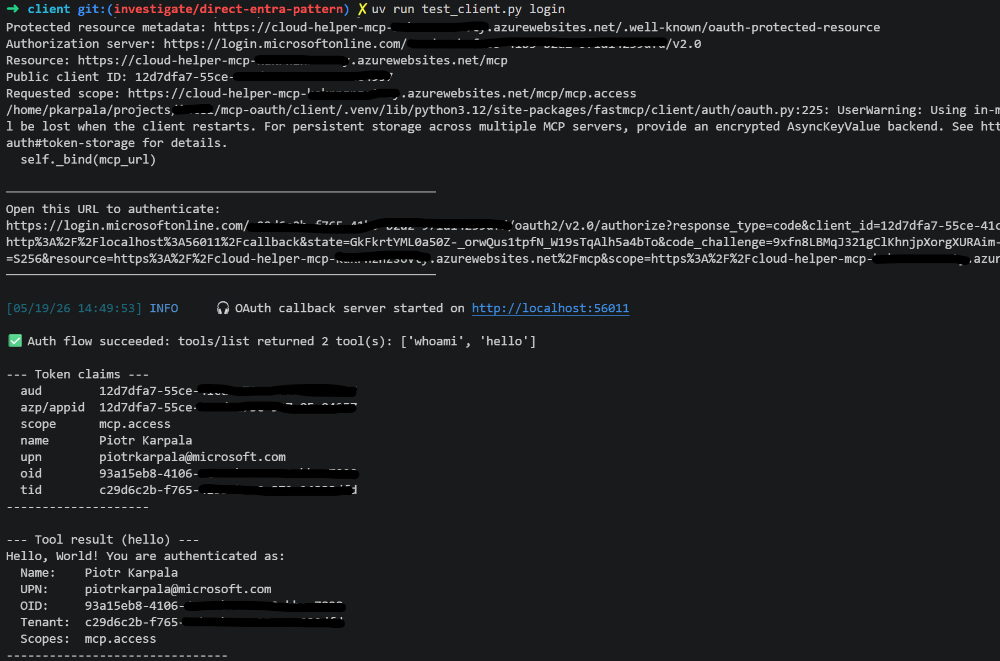

# MCP OAuth — Entra ID Authentication & Identity Passthrough

Demonstrates a production-ready pattern for deploying a [FastMCP](https://github.com/jlowin/fastmcp) server on Azure App Service with **Microsoft Entra ID authentication**, and connecting it to clients using **OAuth 2.0 Identity Passthrough** — so every tool call is made under the caller's own identity.

## What This Shows

| Client | Auth Mechanism |
|--------|---------------|
| VS Code MCP client | [RFC 9728 Protected Resource Metadata](https://datatracker.ietf.org/doc/html/rfc9728) — native account picker, no browser |
| `test_client.py` | OAuth 2.0 PKCE flow — browser redirect, token introspection |
| `agent_v2/` (Azure AI Foundry) | **Entra Identity Passthrough** via Foundry connection — agent calls MCP as the signed-in user |

In all three cases the MCP server receives a real Entra bearer token and can inspect the caller's identity (UPN, OID, tenant, scopes).

## Architecture

```
┌─────────────────────────────────────────────────────────────────┐
│                     Microsoft Entra ID                          │
│   App Registration: mcp-server                                  │
│   Identifier URI:   https://<app>.azurewebsites.net/mcp         │
│   Scope:            mcp.access                                  │
└───────────────────────────┬─────────────────────────────────────┘
                            │ OAuth 2.0 / OIDC
           ┌────────────────┼────────────────┐
           │                │                │
    ┌──────▼──────┐  ┌──────▼──────┐  ┌─────▼──────────────────┐
    │  VS Code    │  │ test_client │  │  Azure AI Foundry       │
    │  (RFC 9728) │  │  (PKCE)     │  │  agent_v2 (passthrough) │
    └──────┬──────┘  └──────┬──────┘  └─────┬──────────────────┘
           │                │               │ Bearer token (user's identity)
           └────────────────┴───────────────┘
                            │
              ┌─────────────▼─────────────┐
              │  FastMCP Server            │
              │  Azure App Service         │
              │  JWT validation (Entra)    │
              │  tools: whoami, hello      │
              └────────────────────────────┘
```

## Entra Identity Passthrough in Action

### VS Code (RFC 9728 — native account picker)

Add to `.vscode/mcp.json`:

```json
{
  "servers": {
    "cloud-helper": {
      "type": "http",
      "url": "https://<your-app>.azurewebsites.net/mcp"
    }
  }
}
```

VS Code auto-discovers authentication via the server's `/.well-known/oauth-protected-resource` endpoint — no auth config needed. It uses the built-in Microsoft account picker (no browser redirect).



*VS Code: `whoami` returns the authenticated user's identity — Subject, Tenant, Audience, Client ID, and `mcp.access` scope — all from the native Entra token.*

### Azure AI Foundry Agent (`agent_v2/`)

The Foundry agent uses `MCPTool` with `project_connection_id` — Foundry fetches a **delegated token for the signed-in user** and forwards it to the MCP server automatically. No manual token acquisition.



*Foundry Playground: the `whoami` tool returns the authenticated user's Name, UPN, OID, Tenant, and scope — all from the passthrough token.*

### CLI Agent (`agent_v2/agent.py`)

```bash
cd agent_v2 && uv run agent.py --prompt "say hello to World"
```



*The agent creates a Foundry v2 agent, auto-approves MCP tool calls, and receives the caller's identity from the server.*

### Test Client (PKCE flow)

```bash
cd client && uv run test_client.py login
```



*The test client discovers auth via Protected Resource Metadata, completes a PKCE flow, and calls the MCP tools with the resulting token.*

## Key Design Decisions

**No OAuth proxy.** The MCP server registers directly as an Entra resource with its own `identifierUri` and `mcp.access` scope. Clients authenticate directly to Entra — no intermediary.

**RFC 9728 Protected Resource Metadata.** The server exposes `/.well-known/oauth-protected-resource` so clients like VS Code auto-discover the authorization server, resource URI, and required scope.

**`https://` identifier URI.** The app registration uses `https://<hostname>/mcp` (not `api://`) as the identifier URI so the `resource` parameter in OAuth requests matches the scope namespace — avoiding `AADSTS9010010`.

**Identity Passthrough.** Foundry's `project_connection_id` field on `MCPTool` instructs Foundry to forward a delegated token for the current user. The MCP server validates this token and extracts the caller's identity — every tool invocation is attributable to a real user.

## Repository Structure

```
├── server/           # FastMCP server (Python, App Service)
│   ├── server.py     # MCP app + Protected Resource Metadata handler
│   └── config.py     # Entra config (audience, scope, PRM)
├── client/           # Test client (OAuth PKCE)
│   └── test_client.py
├── agent_v2/         # Azure AI Foundry agent (Identity Passthrough)
│   └── agent.py
├── infra/            # Bicep — App Service, Entra app reg, Foundry
└── azure.yaml        # AZD hooks (provision connection, patch app reg)
```

## Deploy

```bash
azd up
```

After deployment, the postprovision hook:
1. Creates the Foundry MCP connection with the correct OAuth scope
2. Automatically registers the Foundry redirect URI in the Entra app registration

The postdeploy hook writes ready-to-use `.env` files for both `client/` and `agent_v2/`.

## Local Testing

**Test client** (PKCE browser flow):
```bash
cd client
uv sync
uv run test_client.py login
```

**Foundry agent** (Identity Passthrough):
```bash
cd agent_v2
uv sync
uv run agent.py --prompt "Who am I? Call the whoami tool."
```

On first run the agent opens a browser for one-time OAuth consent; subsequent runs are silent.

## Container Image (GHCR)

A multi-arch (linux/amd64, linux/arm64) image is published to GitHub Container Registry on every `v*.*.*` git tag:

```bash
docker pull ghcr.io/karpikpl/mcp-oauth:latest

docker run --rm -p 8000:8000 \
  -e TENANT_ID="<entra-tenant-id>" \
  -e CLIENT_ID="<mcp-app-client-id>" \
  -e RESOURCE_HOST="<public-hostname>" \
  ghcr.io/karpikpl/mcp-oauth:latest
```

`RESOURCE_HOST` must be the public hostname clients use to reach the server — it's baked into the issued audience and the `/.well-known/oauth-protected-resource` document. Cut a release with `git tag v0.1.0 && git push origin v0.1.0`; the `release.yml` workflow builds, signs (cosign keyless), and pushes with semver tags (`latest`, `0.1.0`, `0.1`, `0`).

## References

- [FastMCP](https://github.com/jlowin/fastmcp)
- [RFC 9728 — OAuth 2.0 Protected Resource Metadata](https://datatracker.ietf.org/doc/html/rfc9728)
- [Azure AI Foundry — MCP RemoteTool](https://learn.microsoft.com/en-us/azure/ai-foundry/)
- [azure-ai-projects SDK](https://pypi.org/project/azure-ai-projects/)

## License

MIT

